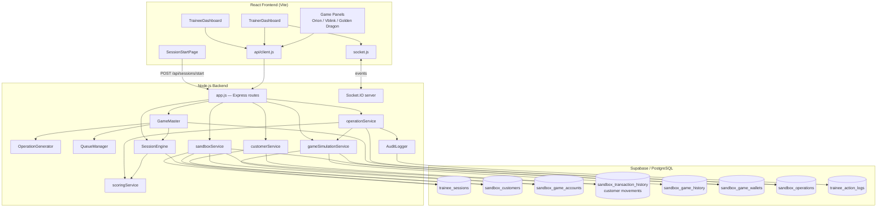
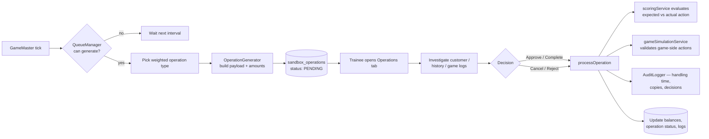
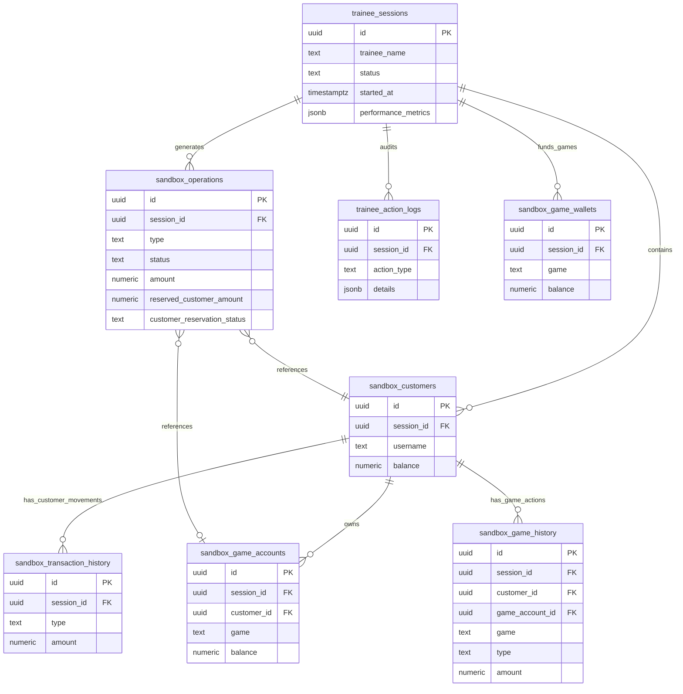

# Casino Operator Training Simulator (Sandbox)

## Local foundation verification

The reproducible local Supabase bootstrap and all foundation commands are
documented in `docs/LOCAL_SETUP_AND_VERIFICATION.md`. The ordinary browser gate
is fast and mocked:

```powershell
npm run verify:foundation
```

The fully real browser flow is deliberately opt-in and fails closed unless its
Supabase API, PostgreSQL, backend, and frontend URLs are loopback-only:

```powershell
npm run local:start
$env:TREZ_LOCAL_E2E = '1'
npm run test:e2e:local
Remove-Item Env:TREZ_LOCAL_E2E
```

Do not run `local:reset` while a backend process is active. Nothing in the real
local E2E command targets the configured hosted Supabase project.

The Training Hub is available behind an explicit frontend flag. Local setup now
configures username/password authentication backed by Supabase Auth JWT sessions;
missing Auth configuration still fails closed with `503`:

```powershell
$env:VITE_TREZ_HUB_ENABLED = 'true'
npm run dev:frontend
```

Run the real local Hub persistence/RBAC verification after starting or resetting
the isolated stack:

```powershell
npm run verify:local:hub
```

This gate uses only loopback Supabase URLs and an in-process test verifier. It
proves assignment, the Module 1–4 prerequisite chain, Module 1/2 completion,
Module 3 policy/artifact fail-closed behavior, idempotent writes, direct-object
isolation, restart/second-client persistence, reporting through a test-only
visibility resolver, browser-role database denial, and guarded fixture cleanup.
It is not a production authentication configuration.

Run the separate real local Supabase Auth/governance gate with the local stack
running and port `8080` free:

```powershell
npm run verify:local:hub:auth
```

That runner sources only the named local Supabase stack, creates and cleans up
reserved-prefix accounts, and checks username/password login, generated usernames,
staff password controls, `HttpOnly` session cookies, CSRF, server-derived roles,
all-Postulante TRAINER/RRHH visibility, two-year attempt-retention metadata, and
two-person publication. It does not bootstrap or mutate hosted Supabase. Hosted
HTTPS origin values and a controlled first-ADMIN procedure are
still deployment inputs; see `docs/LOCAL_SETUP_AND_VERIFICATION.md`.

Create the repeatable local ADMIN fixture after a reset with
`npm run local:bootstrap:admin`. Its local-only credentials are `Ladmin` / `Ladmin`.
TRAINER and RRHH create Postulante accounts from a first name and first surname;
ADMIN creates TRAINER accounts. `Juan Pérez` becomes
`Jperez`, then `Jperez2` on collision, and the initial password equals the final
username. POSTULANTE passwords cannot be changed or reset. ADMIN, TRAINER, and
RRHH may change their own password, and ADMIN may reset another staff account to
its username. No user-facing email credential or recovery flow exists.

The approved locale boundary is English-only for Postulantes and English/Spanish
for TRAINER, ADMIN, and RRHH. TRAINER and RRHH can manage all Postulantes and
their course assignments. RRHH reporting remains read-only across all
Postulantes' module completion plus sanitized original simulator operation/failure
evidence. Legacy sessions remain unlinked unless a Hub attempt carries an
explicit `legacy_trainee_session_id`; names are not identity links. Password
literals, raw request payloads, tokens, cookies, and authorization values are
excluded from RRHH projections.

The approved curriculum policy now distinguishes unlimited standard learning and
practice from four formal scored evaluations: three prerequisite checkpoints and
the final pre-training readiness evaluation. Each formal evaluation requires
100% and permits three attempts per set. After attempt one or two, POSTULANTE may
submit the latest numerical result and close the evaluation; attempt three
auto-submits. All attempts remain auditable, while POSTULANTE sees no detailed
failure evidence. TRAINER may reopen an evaluation only with a required reason,
which grants a new set of three attempts and is visible only to TRAINER and RRHH.
The default score composition is 20% theory and 80% practical, adjustable by
TRAINER only through versioned Advanced Settings.

## Current local implementation status

The simulator and Training Hub are consolidated on local `main`. The local
Supabase migration chain is the source of truth for the implemented sandbox;
the configured hosted Supabase project has not been migrated or changed.

Each new simulator session currently seeds 40 customers:

- 26 customers receive one account in each of Orion Stars, Vblink, and Golden
  Dragon.
- 14 customers intentionally begin with no game accounts. They provide valid
  Create Account practice targets.

The generated **Create Account** operation model selects a customer/game pair
that has no existing account and uses that customer's Backend username as the
request identity. This restriction applies to account-creation operation models
only. Free simulator game screens remain permissive: they may create an account
with any valid values required by that simulator.

For **Add Credits** and **Withdraw Credits**, the Backend requires a confirmation
before settlement. Cancelling requires a non-empty reason; it is persisted with
the Backend movement, is visible as operational evidence, and is not part of
the score calculation yet. A game-side action remains in game history while the
Backend decision remains in Backend customer-movement history; approving a
movement never creates a second game transaction.

Use `npm run verify:local:data` after `npm run local:reset` to check the seed,
queue, reservation, history, cancellation-reason, and account-creation
invariants against the isolated local stack.

## Milestone 2 guarded scaffold

The local Hub seeds the current provisional course content, including Modules
1–11. Module 3 includes a native Account ID Lab shell
that consumes only a server-assigned versioned policy. Module 4 includes an
application-controlled exact-player search that observes `Ctrl+F`, a real paste,
the exact query/match, and positive confirmation.

Module 5 begins a focused Orion Stars Refresh Balance exercise inside the Hub.
It opens only a bounded game-balance surface and calls an authenticated Hub
endpoint; it does not open or start the time-limited full simulator. The Hub
server verifies the observed game Credit and Available Balance before recording
the activity attempt. The practice surface includes tabs for Orion Stars,
Vblink, and Golden Dragon so the same activity shell can be extended across
all three games. Orion Stars is available now; Vblink and Golden Dragon remain
clearly marked “Coming soon” and their disabled tabs cannot call an endpoint or
start a simulator session.

Orion Stars is the approved first reference adapter. Its Free Simulator account
creation remains ungraded, shows an Orion-styled success prompt, and returns a
password-free artifact candidate. Account-structure enforcement is reserved for
the Game Account Creation module and final assessment. The Backend request ends
through its pencil form after the operator enters the created game ID, password,
and Orion kiosk and clicks Confirm.

The seeded policy and created-account artifact are deliberately marked
`required`, so these activities cannot be completed in the UI or by calling the
service-role-backed completion RPC with forged browser state. Finishing this
vertical slice still requires Trez to approve Orion's exact
account-identifier/credential policy and the secure Hub-to-simulator attempt
link that will publish the durable artifact. See
`docs/TREZ_TRAINING_HUB_MILESTONE2_STATUS.md`.

Module 6 now adds a focused, untimed Orion Stars Add Credits exercise. It uses
the existing reservation RPC, shows the customer hold separately from the game
wallet, records one game-side credit, and requires an explicit Backend approve
or cancel decision. Approval is rejected until game evidence exists; cancel
releases the customer reservation exactly once. The activity remains
provisional and non-scored, and the Vblink and Golden Dragon tabs are visible
but unavailable until their adapters are implemented.

Module 7 adds the matching focused, untimed Orion Stars Withdraw Credits exercise.
The game account decreases and the independent game wallet increases; the
existing Backend movement is approved or cancelled exactly once. It remains
provisional and non-scored, with Vblink and Golden Dragon unavailable.

Module 10 is seeded as a provisional mixed-operation orientation and checklist.
Its executable practice remains blocked until Trez approves scenario scheduling,
difficulty, timing, remediation, and attempt rules.

The current Module 11 scaffold predates the approved expanded curriculum. Its
guarded assessment foundation must move to the new last readiness module after
the three checkpoint modules are placed. TRAINER and RRHH can
configure a 30-minute default duration and, under Advanced Settings, a random
2–6 operation range and eligible operation types. Every attempt retains a
database-revisioned configuration snapshot. The separate scored-evaluation
governance foundation now enforces three-attempt sets, explicit/automatic
submission, TRAINER-only reasoned reopening, private staff evidence, immutable
published policy, exact required family/action matrices, and the 20/80 default.
All four evaluations remain draft and provisional: the app cannot execute or
publish them until approved theory answer keys, checkpoint-to-module mapping,
and adapter-derived action evidence replace caller-supplied correctness. The
reporting screen filters attempts by Postulante,
date, outcome, score, duration, operation/category/game/failure, and configuration
revision, and shows pass, score, duration, accuracy, failure, readiness, and trend
statistics. Execution remains blocked until the Reset Password, exceptional-
operation, scheduling, scoring-evidence, and recovery policies are approved.

## Project Vision

This project is not a real casino platform.

It is a sandbox-based training simulator designed to evaluate and improve the performance of casino backoffice operators (trainees).

The system simulates a realistic casino support environment where trainees must manually process customer operations while handling pressure, validating balances, reviewing transaction history, and making correct operational decisions.

Every trainee operates inside an isolated temporary sandbox session.

At the end of the session:

- the sandbox is destroyed,
- scores and analytics are preserved,
- and the trainee must start again from a fresh seeded environment.

The goal is to measure:

- accuracy,
- speed,
- decision-making,
- operational consistency,
- and ability to detect incorrect or suspicious requests.

---

# Core System Philosophy

The platform is session-simulation-centric.

It is NOT:

- a banking platform,
- a production casino backend,
- or a persistent transactional system.

Instead, the application generates temporary simulated realities for trainees.

Each session:

- starts from a baseline seed,
- contains simulated customers,
- includes historical transactions,
- generates random operational requests,
- simulates game activity,
- and evaluates trainee decisions.

Every trainee session must feel like operating a live casino backoffice.

---

# Sandbox Lifecycle

## 1. Session Start

When a trainee starts a session:

- A new isolated sandbox is created.
- Seeded customers and accounts are cloned.
- Existing transaction history is generated.
- Historical gameplay activity is generated.
- Initial balances and logs are prepared.
- Background game simulators begin running.
- The Game Master begins injecting random operations.

Important:
The sandbox must already contain realistic historical transaction history before the trainee receives the first request.

This history is critical because operators must validate requests using:

- movement history,
- gameplay activity,
- current balances,
- and previous operations.

The trainee should never begin with an empty environment.

---

## 2. Runtime Simulation

During the session:

- simulated game activity continues,
- balances evolve,
- requests appear dynamically,
- edge cases may occur,
- fraud-like scenarios may be injected,
- and trainees must manually process requests.

All actions are manual.

The system never auto-completes operations.

The trainee must:

- investigate,
- validate,
- compare balances,
- review logs,
- and choose an action.

Possible actions include:

- Approve,
- Complete,
- Cancel,
- Reject.

---

## 3. Session Completion

When the session ends:

- the sandbox can be destroyed,
- temporary customers can be deleted,
- temporary operations can be deleted,
- temporary logs can be deleted.

Only trainee analytics and reports persist.

The next session starts from the same baseline conditions but with:

- new randomized operations,
- different timings,
- different customer activity,
- different request combinations,
- and potentially different difficulty conditions.

This guarantees replayability and prevents memorization.

---

# Frontend Structure

## OPERATIONS Section

### Movements Tab

Used for credit operations.

Examples:

- Add Credits
- Withdraw Credits

Operators must:

- verify balances,
- review movement history,
- inspect game activity,
- and decide whether the request should be approved or cancelled.

---

### Requests Tab

Used for manual technical requests.

Examples:

- Create Account
- Refresh Balance
- Reset Password

These requests may depend on validating customer data and game activity.

---

# CUSTOMER Section

## Customer Search

Search users by:

- email,
- username,
- or customer identifiers.

---

## Customer Header

Displays:

- username,
- first name,
- last name,
- current balance,
- and account status.

---

## History View

### Movement History

Shows:

- deposits,
- withdrawals,
- approved operations,
- cancelled operations,
- and generated transaction history.

This history exists BEFORE the trainee starts processing requests.

Historical movement generation is a required part of sandbox creation.

---

### Game Logs

Shows simulated activity from the supported game simulators.

Examples:

- wagers,
- wins,
- losses,
- jackpots,
- balance refreshes,
- delayed updates.

These logs help trainees determine whether balances are valid.

---

## Games View

Displays active game accounts and simulated game information.

Supported simulated platforms currently include:

- Orion Stars
- Vblink
- Golden Dragon

---

# Backend Simulation Engine

## Game Master

The Game Master is the central simulation orchestrator.

Responsibilities:

- inject random operations,
- generate runtime events,
- simulate realistic workloads,
- trigger edge cases,
- create pressure scenarios,
- and maintain session activity.

The Game Master should eventually evolve from a random generator into a scenario orchestration engine.

---

# Architecture Flow Structure

This section describes how the simulator is wired end-to-end: layers, session lifecycle, operation flow, persistence, and the main code modules.

## System Overview

The application follows a **session-centric, API-driven architecture**:

| Layer | Technology | Role |
|-------|------------|------|
| **Client** | React + Vite | Trainee and trainer UIs, game platform panels, operation queue |
| **API** | Express (Node.js) | REST endpoints for sessions, operations, customers, games, trainer tools |
| **Realtime** | Socket.IO | Live trainer dashboard updates (`session-created`, `session-updated`) |
| **Simulation** | Game Master + engines | Sandbox seeding, queue generation, scoring, audit logging |
| **Persistence** | Supabase (PostgreSQL) | Per-session sandbox state and retained trainee analytics |



---

## Session Lifecycle Flow

Every trainee run is an isolated sandbox session. The flow below matches the current implementation.

```mermaid
sequenceDiagram
  participant Trainee as Trainee UI
  participant API as Express API
  participant Sandbox as sandboxService
  participant GM as GameMaster
  participant DB as Supabase

  Trainee->>API: POST /api/sessions/start { traineeName, durationMinutes }
  API->>Sandbox: createSandboxSession()
  Sandbox->>DB: Insert trainee_sessions
  Sandbox->>DB: Seed sandbox_customers
  Sandbox->>DB: Seed one 20,000 loading wallet per game
  Sandbox->>DB: Seed sandbox_game_accounts
  Sandbox->>DB: Seed sandbox_transaction_history (pre-session history)
  API->>GM: startSession(sessionId, durationMs)
  GM->>GM: generateOperations() immediately
  GM->>GM: setInterval — periodic operation injection
  GM->>GM: setTimeout — auto-close session
  API-->>Trainee: session object (stored in localStorage)

  loop While session active
    GM->>DB: Atomically insert PENDING operation<br/>and reserve Add Credits when applicable
    Trainee->>API: GET /api/operations/:sessionId
    Trainee->>API: POST /api/operations/:id/process { action }
    API->>DB: Update operation, balances, game accounts
    API->>DB: Log trainee_action_logs (AuditLogger)
  end

  alt Trainee submits early
    Trainee->>API: POST /api/sessions/:id/submit
  else Timer expires
    GM->>API: completeSession() via auto-close
  else Trainer ends session
    Trainee->>API: POST /api/sessions/:id/stop
  end

  API->>GM: stopSession(sessionId)
  API->>SE: submitSession / completeSession
  SE->>DB: Score operations, persist performance metrics
  Note over DB: Sandbox rows may be deleted;<br/>session scores and audit logs persist
```

### Sandbox creation (what gets seeded)

When `createSandboxSession()` runs, the environment is **never empty**:

1. **Session record** — `trainee_sessions` (trainee name, timestamps, status).
2. **Customers** — cloned baseline profiles with balances in `sandbox_customers`.
3. **Game accounts** — Orion Stars, Vblink, and Golden Dragon accounts per customer in `sandbox_game_accounts`.
4. **Game loading wallets** — an independent 20,000 operational balance per game in `sandbox_game_wallets`; these are not customer balances.
5. **Movement history** — pre-generated Backend customer deposits/withdrawals in `sandbox_transaction_history` (operators validate against this before the first live request).

Only after seeding does **Game Master** begin injecting live `sandbox_operations` into the queue.

---

## Runtime Operation Flow

Incoming work is always **manual** on the trainee side. The backend never auto-approves queue items.



**Operation types** generated at runtime (weighted by Game Master):

- `ADD CREDITS` / `WITHDRAW CREDITS` (Movements)
- `CREATE ACCOUNT` / `RESET PASSWORD` / `REFRESH BALANCE` (Requests)

**Trainee actions** sent to `POST /api/operations/:id/process`:

- Approve, Complete, Cancel, Reject (validated by `scoringService`)

---

## Backend Module Map

```
backend/src/
├── server.js              # HTTP server + Socket.IO bootstrap
├── app.js                 # Express app, CORS, route mounting
├── config/
│   └── supabase.js        # Supabase client
├── routes/
│   ├── sessionRoutes.js   # Start, stop, submit, delete sessions
│   ├── operationRoutes.js # Queue fetch + process operations
│   ├── customerRoutes.js  # Search + movement/game history
│   ├── gameRoutes.js      # Game account CRUD, recharge, redeem
│   └── trainerRoutes.js   # Trainer dashboard, audit, analytics
├── engine/
│   ├── GameMaster.js      # Session orchestrator, operation injection
│   ├── OperationGenerator.js
│   ├── QueueManager.js    # Pending limits + generation interval
│   ├── SessionEngine.js   # Complete, submit, delete, scoring rollup
│   └── AuditLogger.js     # trainee_action_logs
└── services/
    ├── sandboxService.js       # Session + seed world creation
    ├── operationService.js     # Queue + process + evaluate
    ├── customerService.js      # Customer search + history
    ├── gameSimulationService.js# Game account mutations + validation
    └── scoringService.js       # Accuracy, timing, expected actions
```

---

## Frontend Module Map

```
frontend/src/
├── App.jsx                    # Routing: session start, trainee, trainer, game panels
├── api/client.js              # Axios wrapper for all REST calls
├── sockets/socket.js          # Socket.IO client (trainer live updates)
├── pages/
│   ├── SessionStartPage.jsx   # Trainee onboarding + POST /sessions/start
│   ├── TraineeDashboard.jsx   # Main operator workspace
│   └── DashboardPage.jsx      # Trainer / supervisor view
└── components/
    ├── operations/            # OperationsQueue, OperationCard
    ├── customers/             # CustomerPanel, search, history
    ├── games/                 # OrionStars, Vblink, GoldenDragon panels
    ├── performance/           # Session performance summary
    └── audit/                 # AuditLogPanel
```

**Trainee navigation flow:**

1. `SessionStartPage` → creates session → `TraineeDashboard`
2. **Operations** — Movements and Requests tabs process the live queue
3. **Customer** — search, header, movement history, game logs
4. **Games** — opens simulated platform UIs (`/games/orion-stars/:sessionId`, etc.)

---

## REST API Surface

| Prefix | Purpose |
|--------|---------|
| `GET /health` | Backend health check |
| `/api/sessions` | List, start, get, stop, submit, delete sessions |
| `/api/operations/:sessionId` | Pending operation queue for a session |
| `/api/operations/:id/process` | Trainee decision on a single operation |
| `/api/customers/:sessionId` | Customer search within sandbox |
| `/api/customers/:sessionId/:customerId/history` | Backend customer movement history only |
| `/api/games/:sessionId/customers/:customerId/history?game=...` | Game action history for the selected game |
| `/api/games/:sessionId/:game/accounts` | Game account search and creation |
| `/api/games/accounts/:id/recharge` | Simulated add credits on game account |
| `/api/games/accounts/:id/redeem` | Simulated withdraw credits |
| `/api/games/accounts/:id/reset-password` | Password reset simulation |
| `/api/trainer/*` | Trainer dashboard, audit logs, analytics, session admin |

---

## Data Model (Sandbox vs Persistent)

The separated history, wallet, reservation, and queue constraints below require
the tracked local Milestone 0 migration. It has not been applied to a shared
database; disposable-database rehearsal remains an exit gate.



| Data | Lifetime |
|------|----------|
| `sandbox_customers`, `sandbox_game_accounts`, `sandbox_game_wallets`, `sandbox_transaction_history`, `sandbox_game_history`, `sandbox_operations` | **Disposable** — tied to the active sandbox; deleted when the session is torn down |
| `trainee_sessions` (scores, performance), `trainee_action_logs` | **Persistent** — used for evaluation, trainer review, and analytics |

---

## Technology Stack

| Component | Stack |
|-----------|-------|
| Frontend | React 18, Vite, Axios, Socket.IO client |
| Backend | Node.js, Express, Socket.IO |
| Database | Supabase (PostgreSQL) |
| Deployment | Backend Dockerfile; frontend `vercel.json` |

Environment variables (typical):

- Backend: `PORT`, `CLIENT_URL`, Supabase URL and service key
- Frontend: `VITE_API_URL` pointing at the Express API base

---

# Session Isolation

Each trainee session is fully independent.

10 trainees running simultaneously should experience:

- separate customers,
- separate balances,
- separate operations,
- separate histories,
- and separate simulated gameplay.

No trainee action should affect another trainee environment.

---

# Scoring System

The platform evaluates trainees using:

## Accuracy

Measures whether the trainee made the correct operational decision.

Examples:

- approving valid requests,
- cancelling invalid withdrawals,
- detecting balance inconsistencies,
- identifying suspicious activity.

---

## Speed

Measures:

- response time,
- processing time,
- and operational efficiency.

Timing starts the moment the request appears.

---

## Traceability

Every trainee action is logged.

Examples:

- processed operations,
- timestamps,
- decisions,
- correctness,
- and workflow actions.

---

# Long-Term Vision

The system should eventually support:

- difficulty modes,
- fraud scenarios,
- overload simulations,
- VIP customer handling,
- advanced analytics,
- trainer dashboards,
- session replay,
- AI-generated scenarios,
- and performance trend analysis.

---

# Architectural Principles

## Important Principle #1

The session is temporary.

The sandbox is disposable.

Only reports and trainee analytics persist.

---

## Important Principle #2

The seed world remains stable.

Randomized events create replayability.

---

## Important Principle #3

The trainee must always have enough historical information to make operational decisions.

This means:

- seeded movement history,
- pre-generated game logs,
- and historical balance activity
  must already exist when the session starts.

---

## Important Principle #4

The simulation engine is the real product.

The database is primarily:

- runtime state,
- sandbox memory,
- and evaluation storage.

---

# Final Summary

This project is a real-time operational training simulator for casino backoffice trainees.

It combines:

- isolated sandbox environments,
- dynamic operation generation,
- simulated gameplay activity,
- customer management workflows,
- and trainee evaluation systems.

The purpose is to simulate realistic operational pressure while measuring trainee performance in a controlled environment.

The simulator focuses specifically on frontline operational workflows rather than fraud investigation or payment analysis.

Operators are trained to:

- manage balances,
- process requests,
- navigate game platform backoffices,
- and complete workflows efficiently and accurately.

The core operational modules are:

## Movements

- Add Credits
- Withdraw Credits

## Requests

- Create Account
- Reset Password
- Refresh Balance

The trainee is not expected to deeply audit gameplay records or perform fraud analysis.

Game history and transaction records primarily exist to:

- provide realism,
- simulate authentic platform environments,
- and help operators understand customer context.

The supported platforms currently being simulated are:

- Orion Stars
- Vblink
- Golden Dragon

The goal is to emulate the actual backoffice systems used by operators within those gaming platforms.

---

# Conversation Recovery Prompt

Use the following prompt if this conversation is lost and you need to restore project context quickly:

I am building a sandbox-based casino backoffice operator training simulator.

The project is NOT a real casino backend.

The goal is to train frontline operators/trainees that work inside gaming platform backoffice panels such as Orion Stars, Vblink, and Golden Dragon.

The simulator focuses specifically on operational workflows, not fraud investigation or payment analysis.

Core operation modules:

1. Movements

- Add Credits
- Withdraw Credits

2. Requests

- Create Account
- Reset Password
- Refresh Balance

The trainee operates inside a temporary isolated sandbox session.

Each session:

- clones seeded customer/account data,
- starts with pre-generated transaction history,
- starts with existing gameplay logs/history,
- generates randomized incoming operations,
- simulates realistic operator workloads,
- evaluates speed and accuracy,
- and resets completely after completion.

The sandbox is disposable.
Only trainee reports/scores persist.

The purpose of the simulator is:

- workflow familiarity,
- operational speed,
- queue handling,
- platform navigation,
- and operational accuracy.

The trainee is NOT expected to deeply investigate gameplay or detect fraud.

The system architecture should focus on:

- isolated session sandboxes,
- runtime operation generation,
- simulated backoffice environments,
- scoring/evaluation systems,
- and realistic operational workflows.

The frontend structure contains:

- Operations section
- Customer section
- Movements tab
- Requests tab
- Customer search
- Games view
- Transaction history

The supported simulated platforms currently are:

- Orion Stars
- Vblink
- Golden Dragon

The UI inspiration comes from real casino/sweepstakes backoffice management systems.

The project stack currently uses:

- Node.js
- Express
- Supabase
- React/Vite frontend

Please continue helping me architect and develop this simulator from this context instead of restarting from scratch.
